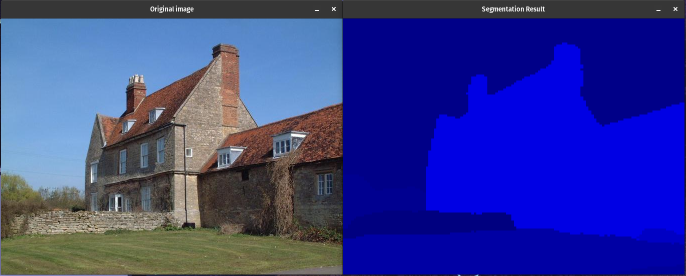
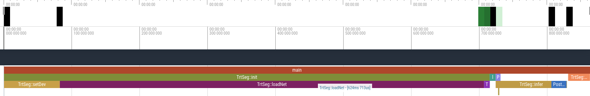

TensorRT Segmentation
===========================

# Introduction
This is a simple implementation of TensorRT engine for the image segmentation task.

This project:

1. Downloads [*nvidia/segformer-b4-finetuned-ade-512-512*](https://huggingface.co/nvidia/segformer-b4-finetuned-ade-512-512) model from HuggingFace hub.  
2. Python script *trtconverter.py* converts the model to TensorRT plan and saves it to the disk.
3. C++ application `trtinfer` processes input image through the saved TensorRT model, saves resulted semantic information to the disk, and visualizes the result.
4. C++ application also outputs to the console logs detailing how much time network loading and inference took. It also has integrated profiler, that shows more detailed information.

# Results

Below is the sample output of this project.



# Setup

This project requires following libraries to be installed:
1. NVidia driver (tested on v.550.67)
2. CUDA (tested on v.12.0)
3. CuDNN (tested on v.8.9.0)
4. TensorRT (tested on v.8.6.1)
5. Python (tested on v.3.10)

In addition *trtconverter.py* requires libraries from `requirements.txt` file (for TensorRT v10) or `requirements_oldgpu.txt` file (for TensorRT v8). 
These can be installed using following command:

```
pip3 install -r requirements.txt
pip3 install -r requirements_oldgpu.txt
```

## C++ compilation

`trtinfer` application should be available in `build` directory, but one can compile it for specific architecture.  

To compile C++ application from scratch following libraries also need to be installed:

```
sudo apt install -y cmake g++ wget unzip
sudo apt install libopencv-dev libspdlog-dev libfmt-dev xtensor-dev
```

**Note:** Some paths in `CMakeLists.txt` might require adjustments depending on what versions of the libraries and where they were installed.

Once all libraries are installed run following commands to build `trtinfer`:

```
cd build
cmake -G "Unix Makefiles" ..
make
```

# Usage

## TensorRT conversion (python)
To generate TensorRT model, run:

```
python trtconverter/trtconverter.py
```

Some script parameters can be changed manually in the beginning of the script inside of the constants. e.g.  

```python
OUTPUT_PATH = "out/"
ENABLE_FP16 = True
```

### Ouput
Generated *.trt* file will be saved to `out/` directory.

## Inference (C++)

To run inference on `data/image_0.png` run following command:

```
cd build
./trtinfer
```

`trtinfer` file has a number of arguments that can be adjusted:

```
./trtinfer --help
This program processes input image through TensorRT model and saves resulted segmentation.
Usage:
  TensorRT Segmentation [OPTION...]

  -o, --outPath arg        Output path (default: ../out/)
  -m, --modelFilepath arg  Model file path (default: 
                           ../out/segformer-b4_opset17_trt8.trt)
  -i, --imageFilepath arg  Image file path (default: ../data/img_0.png)
  -n, --noshow             Don't show results
  -h, --help               Print usage
```

### Output

1. `trtinfer` will save `classes.png` file into the *outPath*. Note this is a raw file with raw class values. This file might not open in image applications.
2. To display segmentation results, use `--showResults` argument (or just skip it).

# Profiling

## Simplified

`trtinfer` will output time it takes to load and prepare TensorRT plan as well as how much it takes to process the image. It also displays standard TensorRT diagnostic information, for example memory usage.

Here's an example of running `trtinfer` on NVidia 1080ti and Intel 8700k:

```
...
[2024-06-10 22:59:40.547] [info] TensorRT: Loaded engine size: 249 MiB
...
[2024-06-10 22:59:40.996] [info] TensorRT: [MemUsageChange] TensorRT-managed allocation in IExecutionContext creation: CPU +0, GPU +393, now: CPU 0, GPU 637 (MiB)
[2024-06-10 22:59:41.020] [info] Timer: TrtSeg::init time: 715437us
[2024-06-10 22:59:41.133] [info] Timer: TrtSeg::infer time: 104662us
```

## Detailed

`trtinfer` will save `profiling.json` with results of profiling. It can be opened in webapps available at [Perfetto UI](https://ui.perfetto.dev/) or [chrome://tracing](chrome://tracing) (on Chome based browsers).



As we can see on this graph, the slowest part of the code is the loading of the network, which took 624ms in this example.

# Assumptions

Following assumptions were made when working on this project:

1. Only one image needs to be processed at a time.
